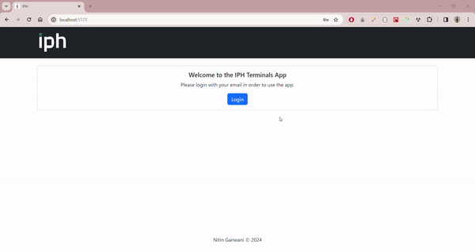

# IPH Technical Assesment

This application allows users to manage terminals through a user-friendly dashboard. Users can explore the list of terminals, view detailed information, and perform various actions such as creating, editing, and deleting terminals. Authentication is implemented to provide secure access to administrator functions.
<br/>
<br/>

**Web tour:**
<br/>



<br/>

**Needed credentials:**

To log in, click on the login button that you can find in the home page.

As an example, consider the user with ID #1:

```
- EMAIL: admin@email.com
- PASSWORD: 12345
```

Simply using these credentials should be sufficient to unlock administrator functions, such as deleting or creating terminals.

<br/>

**Used technologies:**

```
- Typescript
- React
- Redux Toolkit
- SASS (SCSS / Flexbox & Grid)
- Bootstrap
- React Router DOM
```

<br/>

**Used libraries:**

```
- React Bootstrap
- React Icons
- Sweetalert2
```

<br/>

**Commands:**

```shell
# Installation
npm i

# Start app in dev mode
npm run dev

# Build
npm run build
```

**Main features:**

- Single Page Application.
- App state managed via Redux.
- Use of slices and thunks.
- Load, create, edit and delete terminals methods fully implemented.
- Authentication for administrator functions.
- Responsive layout using flexbox.
- Styled components for a modern and consistent design.
